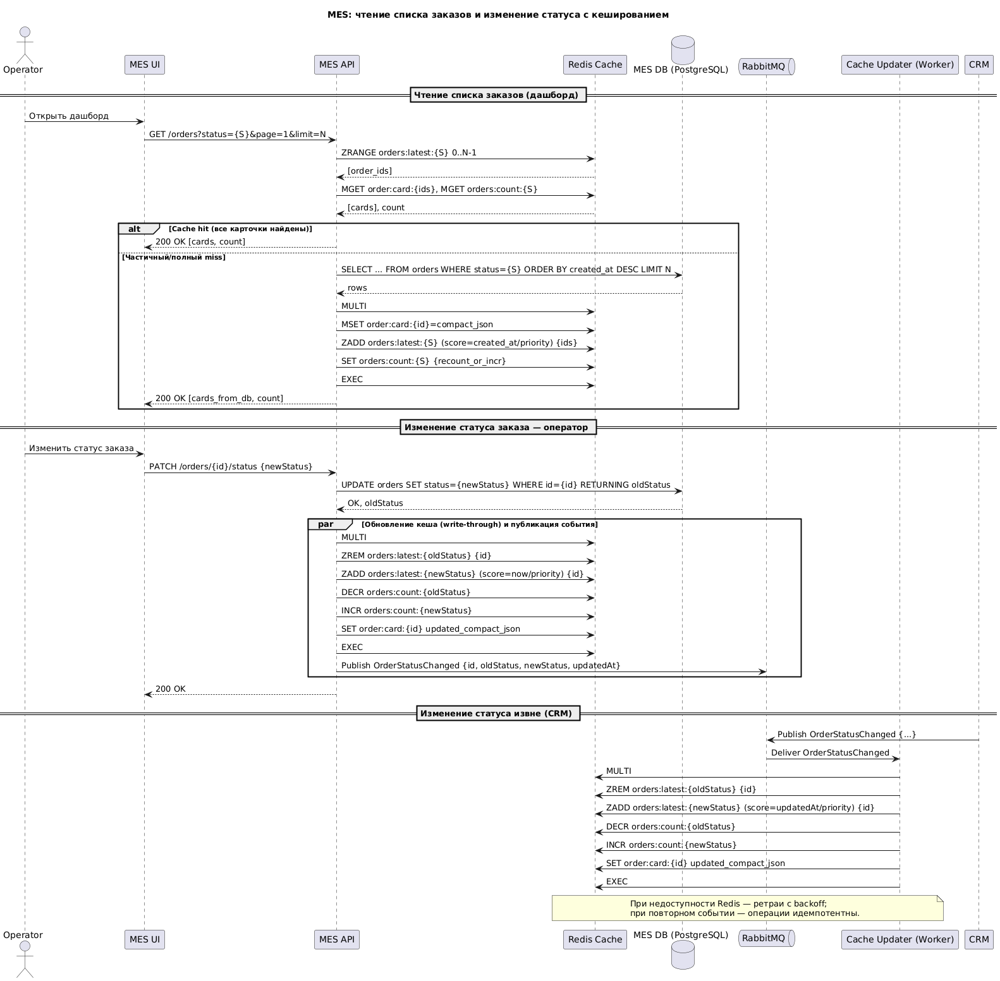

## Мотивация

### Почему кеширование

- 80–95% времени на первой странице MES уходит на тяжелые агрегирующие запросы: списки «последних N заказов по статусам», счетчики, сортировки, джойны.
- Эти данные многократно читаются множеством операторов, но изменяются редко — только при создании заказа или смене статуса.
- Расчет цены — крайне ресурсоемкая операция. При повторных запросах (повторная оценка одного и того же 3D-файла с одинаковыми параметрами, обращения из внешнего API, повторные действия менеджеров) мы тратим вычислительные ресурсы повторно.

### Что именно кешируем

#### Дашборд MES
- Списки «последних N» заказов по каждому статусу.
- Счетчики заказов по статусам.
- Компактные карточки заказа: `id`, `артикул/имя`, `статус`, `приоритет`, `дата создания`, `срок`, `ответственный`.

#### Результаты расчета стоимости
- Цена и метаданные расчета для комбинации:  
  `{хэш 3D-модели + параметры изготовления + версия тарифов/алгоритма + организация/продавец}`.

### Каких проблем это решит
- Сократит TTFB и общее время рендеринга первой страницы MES до десятков миллисекунд.
- Снизит нагрузку на PostgreSQL и вычислительные воркеры.
- Уменьшит количество «просрочек» в коммуникациях с B2B-клиентами: при повторных запросах цена будет возвращаться мгновенно.
- Стабилизирует внешнее API за счет снижения количества долгих синхронных вызовов и таймаутов.

---

## 3. Предлагаемое решение

### 3.1 Тип кеширования

**Основное** — серверное кеширование на уровне MES API с использованием распределенного in-memory хранилища Redis.  
Конфигурация: 1 primary + 2 replicas, с использованием Sentinel или Cluster для отказоустойчивости.

**Дополнительно** — клиентское HTTP-кеширование для статических ассетов фронтенда (ETag, Cache-Control, immutable).  
Это разгружает фронтовые CDN и статические серверы, но не влияет на бизнес-данные.

#### Почему серверное кеширование
- Критичные данные динамические и общие для множества пользователей — требуется единая точка согласованности.
- Необходима централизованная инвалидация по событиям (например, при смене статуса заказа), что сложно и небезопасно реализовать в браузерных кешах.

---

### 3.2 Что и как кешируем

#### A. Дашборд MES (списки и счетчики)

**Ключи:**
- `orders:latest:{status}` — отсортированное множество (Sorted Set), где ключ — `order_id`, а score — `created_at` / `priority`.
- `order:card:{order_id}` — компактная карточка заказа (JSON, до 0.5–1 КБ).
- `orders:count:{status}` — целочисленный счетчик.

**Чтение данных:**
- При открытии первой страницы MES все данные читаются из Redis:
    - Берем топ N заказов из `orders:latest:{status}`.
    - Для каждого — массовое получение карточек (`mget`).
    - Параллельно — массовое получение счетчиков (`mget`).

**TTL:**
- Для списков и карточек — без TTL (источником правды является поток событий), с резервным восстановлением раз в сутки (бэкфилл).
- Для счетчиков — без TTL, согласованность поддерживается через события.

**Обновление / инвалидация (паттерн: Write-Through на событиях домена)**

На каждое доменное событие (создание заказа, смена статуса, изменение приоритета), опубликованное в RabbitMQ:
- Подписчик в MES:
    - Добавляет/удаляет `order_id` в соответствующие `orders:latest:{status}`.
    - Атомарно обновляет `orders:count:{status}` (инкремент/декремент).
    - Обновляет `order:card:{order_id}`.
- При смене статуса — миграция между наборами статусов выполняется в одной транзакции Redis (MULTI/EXEC или Lua-скрипт).

**Поведение при недоступности Redis:**
- Бизнес-операция не блокируется (degrade to DB): данные сохраняются в БД и публикуется событие.
- Отдельный воркер догоняет кеш по очереди событий.

#### Обоснование паттернов

**Почему Write-Through для дашборда:**
- Операторам нужны самые свежие данные.
- Обновление кеша синхронно с БД по событию обеспечивает минимальную задержку и предсказуемый UX.

**Почему не Cache-Aside:**
- При Cache-Aside данные обновляются только при первом чтении после изменения.
- Это приводит к коротким, но массовым окнам устаревших данных у всех операторов.

**Почему не Refresh-Ahead:**
- Данные меняются по событиям, а не по времени.
- Предварительное обновление по расписанию не дает преимуществ и усложняет логику.

#### Ожидаемый эффект
- Время ответа API дашборда: **10–50 мс** вместо **300–1500+ мс**.
- Снижение QPS к PostgreSQL по этим запросам на **90% и более**.

---

#### B. Результаты расчета стоимости

**Ключи:**

```text
price:{algo_ver}:{tariff_ver}:{seller_id}:{model_sha256}:{params_sha256}
→ {цена, валюта, длительность, дата расчета, trace_id}
```


**Поток обработки:**
1. При запросе расчета MES API сначала проверяет наличие результата в кеше (`GET` по ключу).
2. При **hit** — возвращается мгновенный ответ.
3. При **miss**:
    - Запускается расчет (или задача ставится в очередь).
    - Применяется механизм «single-flight» (распределенная защита от дублирования):
        - `SETNX lock:price:{key}` с коротким TTL.
        - Только первый запрос запускает расчет, остальные ждут.
4. После завершения воркер:
    - Сохраняет результат в БД (если требуется аудит).
    - Записывает результат в кеш (Write-Through).
    - Снимает блокировку.

**Паттерны:**
- На стороне API — **Cache-Aside** (сначала кеш, при промахе — запуск расчета).
- На стороне воркера — **Write-Through** (результат сразу попадает в кеш).

**TTL и инвалидация:**
- TTL: **30–90 дней** (зависит от бизнес-логики повторных запросов).
- Версионирование ключей по `algo_ver` и `tariff_ver`.
- При обновлении алгоритма или тарифов — инвалидация происходит через смену версии (rolling invalidation, без массового `DEL`).
- `seller_id` включается в ключ, если у партнеров разные наценки.

#### Обоснование паттернов

**Почему не чистый Write-Through:**
- Нельзя записать в кеш до завершения расчета — операция слишком дорогая.
- Запись при каждом входе бессмысленна без результата.

**Почему не Refresh-Ahead:**
- Невозможно предсказать, какой файл будет запрошен.
- Эффективнее использовать блокировку и делиться результатом между конкурентными запросами (single-flight).

#### Ожидаемый эффект
- Время ответа для повторных оценок — с **минут** до **миллисекунд**.
- Снижение нагрузки на воркеры расчета.
- Уменьшение таймаутов во внешнем API.

---

### 3.3 Инфраструктура и нефункциональные требования

**Redis:**
- Кластер: 3 узла (1 master, 2 replicas).
- AOF + snapshot для персистентности.
- Мониторинг: latency, hit ratio, memory, evictions.
- Выделенная сеть, TLS, ACL, неймспейсинг ключей по сервисам.

**Оценка объема:**
- Дашборд: ~0.8 КБ на карточку, < 500k активных заказов за 90 дней → ~400 МБ.
- Прайс-кеш: 0.5–1 КБ на запись, до 1 млн ключей → ~1 ГБ.
- Итого: **1.5–2 ГБ** с запасом.

**Наблюдаемость:**
- Метрики:
    - `cache_hit_ratio{endpoint}`
    - p99 latency
    - lock contention
    - количество расчетов в работе
    - время расчета
    - доля повторных запросов
- Логи:
    - Причины промахов: `new_model`, `version_mismatch`, `ttl_expired`.

**Отказоустойчивость:**
- При падении Redis — чтение переходит на БД / запускает расчет (graceful degradation).
- Алерты при снижении hit ratio и росте latency.

**Безопасность:**
- Ключи включают `seller_id` — данные не кросс-тенантные.
- PII (персональные данные) в кеш не сохраняются.

---

### 3.4 План внедрения

**Этап 1. Дашборд:**
- Реализация подписчика на RabbitMQ для наполнения Redis.
- Включение фича-флага для чтения данных из кеша.
- Валидация согласованности: фоновый билдер сравнивает данные в кеше и БД.

**Этап 2. Прайс-кеш:**
- Хэширование 3D-файлов (SHA-256) при загрузке.
- Версионирование тарифов и алгоритма в конфигурации.
- Реализация single-flight блокировок.
- Воркеры записывают результат в кеш и БД.

**Этап 3. Тюнинг:**
- Настройка TTL, размеров выборки N.
- Оптимизация индексов Redis (ZSET).
- Настройка алертов, оптимизация формата карточек и структуры ключей.

---

## 4. Риски и как их снижаем

| Риск | Меры по снижению |
|------|------------------|
| Устаревшие данные на дашборде | Обновление кеша по событиям; периодический бэкграунд-синк с БД |
| «Стадный эффект» при расчетах | Распределенные блокировки + idempotency-ключи |
| Рост памяти Redis | Мониторинг + лимиты; eviction policy `volatile-lru` только для данных с TTL (прайс-кеш); дашборд — без TTL и вне eviction |
| Смена тарифов/алгоритма | Версионирование ключей; старые ключи удаляются по истечении TTL |

---

## 5. Оценка эффекта для бизнеса

- **Время загрузки первой страницы MES** — с секунд до десятков миллисекунд.  
  → Повышение удовлетворенности операторов, ускорение обработки новых заказов.
- **Снижение повторных расчетов и таймаутов** во внешнем API.  
  → Меньше инцидентов «не получили заказ» или «не дождались цены».
- **Запас по производительности** — рост нагрузки в 2 раза без масштабирования БД и кластера расчета.

---

## Диаграмма последовательности (PlantUML)
Включает чтение списка заказов (дашборд), изменение статуса заказа оператором (синхронное обновление кеша + событие) и изменение статуса извне (CRM → событие → обновление кеша воркером).


## 6. Стратегия инвалидации кеша

#### 1. Для дашборда (списки, счетчики, карточки)

**Программная инвалидация по ключу на доменных событиях (event-driven)**

На практике речь идет не о «инвалидации», а о **актуализации данных** — при каждом изменении состояния заказа мы целенаправленно обновляем соответствующие записи в Redis:

- `orders:latest:{status}` — добавление/удаление через `ZADD` / `ZREM`.
- `orders:count:{status}` — атомарное изменение через `INCR` / `DECR`.
- `order:card:{id}` — полное обновление через `SET`.

**Источник событий:**
- Подтвержденные доменные события, публикуемые в RabbitMQ после успешного коммита в БД.
- Для действий из MES API — обновление кеша происходит **синхронно в рамках обработки запроса**, а затем публикуется событие для согласованности с внешними системами.

**Дополнительная защита от расхождений:**
- **Периодический ресинхронизационный джоб (resync job)**, запускаемый раз в сутки:
    - Сравнивает данные в Redis (счетчики, топ-N списки) с данными в PostgreSQL.
    - Автоматически исправляет выявленные расхождения.
    - Позволяет восстановить целостность кеша при возможных сбоях в обработке событий.

---

#### 2. Для кеша результатов расчета стоимости

**Комбинированная стратегия:**

- **Версионирование ключей (namespacing):**  
  Ключ строится с включением версий:

```text
price:{algo_ver}:{tariff_ver}:{seller_id}:{model_sha256}:{params_sha256}
```

При обновлении алгоритма или тарифов — версия меняется, и запросы начинают использовать новое пространство ключей.

- **TTL (30–90 дней):**  
  Обеспечивает автоматическую очистку устаревших записей, предотвращая неограниченный рост памяти.

- **Точечная программная инвалидация (опционально):**  
  При необходимости (например, при удалении 3D-модели или отмене заказа) — можно явно удалить конкретный ключ.

- **Логическое «обнуление» старого кеша:**  
  При смене `algo_ver` или `tariff_ver` старые ключи больше не используются. Они продолжают существовать, но со временем удаляются по истечении TTL.

---

### Почему эти стратегии подходят

#### Для дашборда
- Требуется **максимально быстрая актуальность** — операторы должны видеть изменения сразу.
- Event-driven подход обеспечивает **минимальную задержку** и **предсказуемость**.
- Отсутствует «окно устаревания», характерное для TTL-подхода.
- Актуализация по событию исключает холостые запросы к БД и держит кеш в согласованном состоянии.

#### Для прайс-кеша
- Результаты расчетов **часто повторяются**, могут переиспользоваться месяцами.
- Изменения алгоритмов и тарифов — **редкие и дискретные события**.
- Версионирование позволяет **безопасно «отключить» старый кеш** без массового `DEL`, избегая всплеска нагрузки.
- TTL обеспечивает **автоматическую очистку** от «мертвого» объема.

---

### Почему не подойдут альтернативы

| Альтернатива | Проблемы |
|--------------|---------|
| **Только TTL (без событий)** | <ul><li>Данные устаревают до истечения TTL.</li><li>При массовом истечении — «шторм» промахов и нагрузка на БД.</li><li>Не подходит для дашборда, где нужна свежесть.</li></ul> |
| **Глобальная инвалидация (flush)** | <ul><li>Удаляет весь кеш, вызывая <strong>холодный старт</strong>.</li><li>Приводит к всплеску QPS к БД и воркерам.</li><li>Недопустимо для production-среды.</li></ul> |
| **LRU/eviction как основная стратегия** | <ul><li>Непредсказуемо выбрасывает «горячие» ключи.</li><li>Подходит только для данных с TTL (например, прайс-кеш), но не для дашборда.</li><li>Не обеспечивает контроль над актуальностью.</li></ul> |

---

### Сравнительный анализ стратегий (кратко)

| Стратегия | Где лучше | Плюсы | Минусы / Особенности |
|----------|----------|-------|------------------------|
| **Event-driven по ключу** (выбрана для дашборда) | Дашборд, счетчики, карточки | Почти нулевая задержка, точечное обновление, стабильная нагрузка | Требует надежной системы событий и подписчиков; нужна идемпотентность |
| **Версионирование + TTL** (выбрана для прайсинга) | Результаты расчета, зависящие от версий | Безопасная массовая инвалидация, плавное обновление, автосбор мусора | Старые ключи живут до TTL; требуется управление версиями |
| **Чистый TTL** | Справочники, статика | Простота, не нужны события | Не подходит для данных, требующих немедленного обновления; риск шторма при истечении |
| **Полный flush по событию** | Почти никогда | Простота реализации | Вызывает холодный старт, высокую нагрузку на БД, потеря производительности |

## Итого

- **Основное кеширование** — серверное, на базе Redis.
- **Паттерны:**
    - **Дашборд**: Write-Through по доменным событиям (синхронное обновление кеша).
    - **Прайсинг**: Cache-Aside на чтении + Write-Through из воркера после расчета.
- **Обоснование выбора:**
    - Минимальная задержка для операторов.
    - Предсказуемая актуальность данных.
    - Экономия на самых дорогих вычислениях.
    - Простая и надежная инвалидация через версии и события.